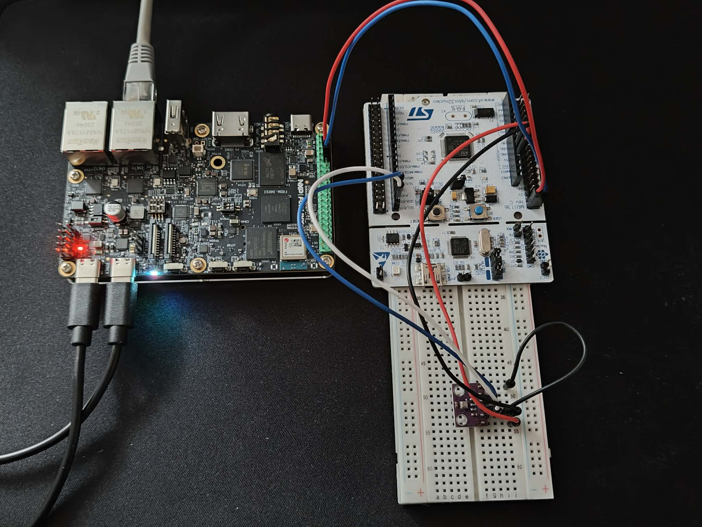

# i.MX 93 and STM32 Sensor Communication
This project consists of two boards, FRDM i.MX93 running Linux and STM32 Nucleo L476RG. STM32 is connected with I2C to BME280 Temperature sensor to gather data. Command system is implemented on STM32, commands can be sent over UART to exchange data from STM32 to i.MX93.

<br>
<div align="center">
    
    
</div>
<br>

Hardware used:\
FRDM i.MX 93\
STM32 Nucleo L476RG\
BME280 Tempereture Humidity and Pressure sensor\
Computer running Ubuntu 24.04

Each board subfolder discusses indepth their respective sections.\
***frdm-imx93** - UART configuration in device tree using Yocto*\
***stm32** - UART and I2C configuration, BME280 driver and command system*

Connection architecture:
```
    Linux                  No OS                Sensor
+-----------+           +---------+           +--------+
|  i.MX 93  |           |  STM32  |    I2C    | BME280 |
|           |           |  PB9 SDA|-----------|SDA     |
|           |   UART    |  PB8 SCL|-----------|SCL     |
| GPIO_14 TX|-----------|RX PC11  |           +--------+
| GPIO_15 RX|-----------|TX PC10  |
+-----------+           +---------+

```

