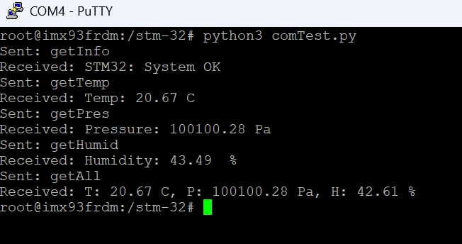

# FRDM i.MX93
This side of the project implements static device tree device UART3 implementation on GPIO pins and Python script for STM32 command testing.

<br>
<div align="center">
    
</div>
<br>

Requirements:\
A computer running Linux\
FRDM-IMX93 board\
Network cable\
USB C cables

I've used Ubuntu 24.04 for debugging and compiling.

## Board setup
Go through [Getting Started with FRDM-IMX93](https://www.nxp.com/document/guide/getting-started-with-frdm-imx93:GS-FRDM-IMX93).\
If you are using Ubuntu 24.04 then you don't have to install CH342F Linux Drivers, they are already included in the Kernel.\
Debug over serial can be accessed over:
```
/dev/ttyAMC*
```
In my case it was /dev/ttyAMC0

For simplicity I've connected over ethernet, that is enough for prototyping.\
SSH / SCP connection is very useful for the development. So write down the board IP to connect to it later, you can use this command.
```
ip a
```

## UART setup
Image was successfully compiled on Ubuntu 24.04. This version of Ubuntu implements some safety features that, as a consequence, will prevent Yocto from compiling, there are ways to bypass them, but I will not share them as I don't know the possible safety consequences of doing so.

Install Patch to the Linux image using Yocto, [here](https://community.nxp.com/t5/i-MX-Processors-Knowledge-Base/How-to-enable-UART3-in-FRDM-IMX93-board/ta-p/2071329) is the guide to do so.

Remember to install dependencies:
```
sudo apt install gawk wget git diffstat unzip texinfo gcc build-essential chrpath socat cpio python3 python3-pip python3-pexpect xz-utils debianutils iputils-ping python3-git python3-jinja2 python3-subunit zstd liblz4-tool file locales libacl1
```

Fist time compiling, in my case, took about 12 minutes.

After flashing the new image, a new device should appear: 
```
/dev/ttyLP2
```
This is the UART3 on ports GPIO_14 (TX) and GPIO_15 (RX).

## Python Testing
The script is extremely simple, it is used only for verification if commands are send and for printing the response. Its purpose is only to show that the system works. 