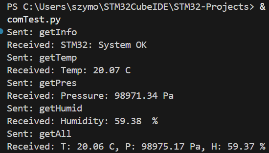

# STM32 Nucleo-L476RG – BME280 sensor and commands over Serial
This project shows how to connect BME280 sensor with the STM32 over I2C and includes UART command system implementation.

This project uses a simple BME280 driver made by me based on the sensor manual, which can be found in References. It works by reading all the data regisers and saves the values. Then those values can be accessed using Read functions. Such solution allows to read the sensor periodically with maintaining a constant access to the data.

Commands are based on UART interrupt and callback. When an interrupt occurss, which is the recived command, then the given command is executed.

Python script used for connecting over COM and command sending is included.

<div align="center">
    
</div>

## BME280 Connection
```
BME280 Pin		STM32 Pin
Vcc				3.3V
GND				GND
SCL				PB8 (SCL/D15)
SDA				PB9 (SDA/D14)
SDO				GND
```
## Build Flags
STM32CubeIDE by default disables float printing. For this program to work it is neccessary to enable this feature.

In CubeIDE:
1. Right-click your project -> Properties
2. Go to C/C++ Build -> Settings
3. MCU G++ Linker -> Miscellaneous
4. Add this to the Other flags field:
```
-u _printf_float
```


## Commands:
Below is the list of the implemented commands. They can easily be tested using *comTest.py*.
```
getInfo
```
Verifies is STM32 is connected to serial port

```
getAll
```
Returns Temperature, Pressure and Humidity data over serial

```
getTemp
```
Returns Temperature data (°C)

```
getPres
```
Returns Pressure data (Pa)

```
getHumid
```
Returns Humidity data (%)

## GPIO, I2C & UART Configuration
PA5 has LD2[green_led] assigned.

### I2C Configuration
1. Enter .ioc file
2. Pinout & Configuration -> Connectivity -> I2C1
3. In the dropdown window select I2C
4. To port PB9 assign I2C1_SDA, to port PB8 assign I2C1_SCL

### UART Configuration
1. In .ioc file
2. Pinout & Configuration -> Connectivity -> USART2
3. In the mode select Asynchronous
4. To port PA2 assign USART_TX, to port PA3 assign USART_RX
5. Verify settings
Below Asynchronous, make sure that Flow control is Disabled.\
In Parameter Settings -> Basic Parameters:\
Baud rate: 115200\
Data bits: 8\
Stop bits: 1\
Parity: None

6. Go to NVIC Settings and Enable USART2 global interrupt

## References
BME280 Manual - https://www.adafruit.com/images/product-files/2652/2652.pdf